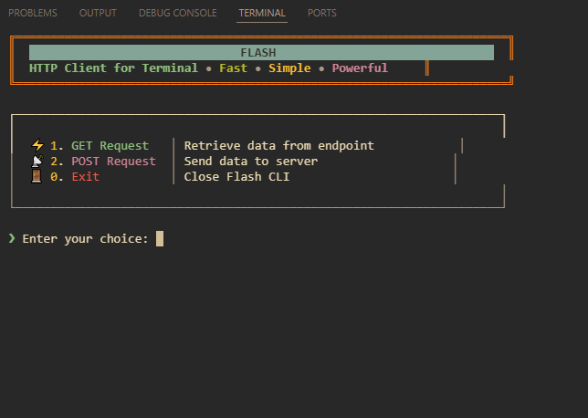
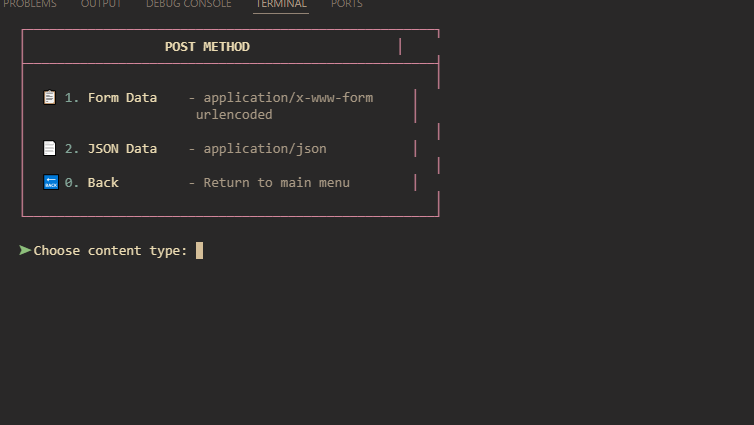
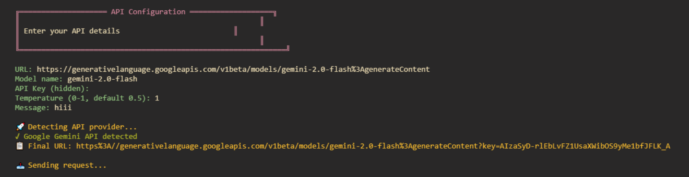

# ⚡ Flash HTTP CLI

> A fast, simple, and powerful HTTP client for your terminal - like Postman, but in CLI with AI API support

[](https://github.com/aadityansha06/Flash-Http-cli/releases)
[](LICENSE)
[](https://en.wikipedia.org/wiki/C_(programming_language))

Flash is a beautiful, terminal-based HTTP client that brings the power of API testing to your command line. Built with C and libcurl, it offers a clean Gruvbox-themed interface that's easy on the eyes and powerful in functionality. Now with integrated AI API support for Claude, GPT, Gemini, and more!

## ✨ Features

- 🌐 **GET Requests** - Fetch data from any REST API with auto-generated code snippets
- 📤 **POST Requests** - Send form data and JSON payloads with multi-line support
- 🤖 **AI API Integration** - Direct API calls to Claude, GPT, Gemini, Groq, Cohere, and Mistral
- 📋 **Code Generation** - Auto-generate request code in JavaScript, Node.js, Python, C#, and Java
- 📄 **Smart Clipboard** - Copy generated code directly to clipboard (supports xclip, xsel, wl-copy, pbcopy)
- 🎨 **Beautiful UI** - Gruvbox dark theme with intuitive navigation
- ⚡ **Fast & Lightweight** - Built in C for maximum performance
- 🔄 **Auto-Updates** - Built-in self-update mechanism from GitHub releases
- 🛡️ **Memory Safe** - Proper memory management and error handling
- 📱 **Cross-Platform** - Works on Linux, macOS, and Termux

## 📸 Screenshots

### Main Menu

*Clean and intuitive main interface with AI API option*

### POST Method Selection

*Easy content-type selection for POST requests*

### AI API Request

*Integrated AI API support with auto-detection for major providers*

## 🚀 Quick Start

### Download Pre-built Binary (Recommended)

Download the latest release for Linux:

```bash
# Download the latest release
wget https://github.com/aadityansha06/Flash-Http-cli/releases/latest/download/flash-linux-x64

# Make it executable
chmod +x flash-linux-x64

# Run Flash
./flash-linux-x64
```

### Build from Source

#### Prerequisites

- GCC compiler
- libcurl development libraries
- Make (optional)

#### Ubuntu/Debian
```bash
sudo apt update
sudo apt install build-essential libcurl4-openssl-dev

# Optional: Install clipboard tools for code copying
sudo apt install xclip
```

#### CentOS/RHEL/Fedora
```bash
# CentOS/RHEL
sudo yum install gcc libcurl-devel

# Fedora
sudo dnf install gcc libcurl-devel xclip
```

#### macOS
```bash
# Using Homebrew
brew install curl

# pbcopy is pre-installed on macOS
```

#### Compilation

```bash
# Clone the repository
git clone https://github.com/aadityansha06/Flash-Http-cli.git
cd Flash-Http-cli

# Build using make
make

# Or compile manually
gcc Flash-cli.c -o flash -lcurl

# Run
./flash
```

### Termux Installation 
```bash
# Install dependencies
pkg update && pkg upgrade
pkg install clang curl

# Clone the repository
git clone https://github.com/aadityansha06/Flash-Http-cli.git
cd Flash-Http-cli

# Compile
clang Flash-cli.c -o flash -lcurl

# Run
./flash
```

**Note:** You may see warnings about getchar() return values or empty-body while loops during compilation. These warnings are safe to ignore — the program will still run fine.

## 🔧 Usage

### GET Requests

1. Select option `1` from the main menu
2. Enter the URL (e.g., `https://jsonplaceholder.typicode.com/posts/1`)
3. View the formatted response
4. **New!** Generate code snippets in your preferred language:
   - JavaScript (Fetch API)
   - Node.js (Axios)
   - Python (Requests)
   - C# (HttpClient)
   - Java (HttpURLConnection)

### POST Requests - Form Data

1. Select option `2` from the main menu
2. Choose `1` for Form Data
3. Enter the number of fields
4. Enter each field in format: `key=value`
5. Enter the target URL
6. Send the request and optionally generate code snippets

**Example:**
```
Number of fields: 3
Field 1: name=John Doe
Field 2: email=john@example.com
Field 3: age=25
```

### POST Requests - JSON

1. Select option `2` from the main menu
2. Choose `2` for JSON Data
3. Enter JSON data line by line
4. Press **Enter twice** to finish input
5. Enter the target URL
6. Send the request and optionally generate code snippets

**Example:**
```json
{
  "name": "Flash User",
  "email": "user@example.com",
  "active": true
}
```

### AI API Requests (NEW!)

1. Select option `3` from the main menu
2. Enter the API endpoint URL
3. Enter the model name (e.g., `claude-3-5-sonnet-20241022`, `gpt-4`, `gemini-pro`)
4. Enter your API key (input is hidden for security)
5. Set temperature (0-1, default 0.5)
6. Enter your message/prompt
7. View the AI response

**Supported AI Providers:**
- **Anthropic Claude** - Auto-detects `anthropic.com` URLs
- **OpenAI GPT** - Auto-detects `openai.com` URLs
- **Google Gemini** - Auto-detects `generativelanguage.googleapis.com` URLs
- **Groq** - Auto-detects `groq.com` URLs
- **Cohere** - Auto-detects `cohere.ai` URLs
- **Mistral** - Auto-detects `mistral.ai` URLs
- **Custom APIs** - Falls back to Bearer token authentication

## 📚 Examples

### Testing REST APIs

```bash
# GET request to fetch user data
URL: https://jsonplaceholder.typicode.com/users/1

# POST form data to create a user
Number of fields: 3
Field 1: name=Flash User
Field 2: email=flash@example.com
Field 3: phone=1234567890
URL: https://httpbin.org/post

# POST JSON data
{
  "title": "Flash HTTP CLI",
  "body": "A powerful terminal HTTP client",
  "userId": 1
}
URL: https://jsonplaceholder.typicode.com/posts
```

### AI API Examples

#### Claude API
```bash
URL: https://api.anthropic.com/v1/messages
Model: claude-3-5-sonnet-20241022
API Key: sk-ant-api03-...
Temperature: 0.7
Message: Write a hello world program in Python
```

#### OpenAI API
```bash
URL: https://api.openai.com/v1/chat/completions
Model: gpt-4
API Key: sk-...
Temperature: 0.5
Message: Explain quantum computing in simple terms
```

#### Google Gemini API
```bash
URL: https://generativelanguage.googleapis.com/v1beta/models/gemini-pro:generateContent
Model: gemini-pro
API Key: AIza...
Temperature: 0.8
Message: Generate a creative story about a robot
```

## 🎨 Theme

Flash uses the **Gruvbox Dark** color scheme for a comfortable terminal experience:

- 🟤 **Background**: Dark, easy on the eyes
- 🟨 **Highlights**: Warm yellows and oranges
- 🟩 **Success**: Bright green indicators  
- 🟥 **Errors**: Clear red error messages
- 🔵 **Info**: Cool blue accents
- 🟪 **Special**: Purple for AI features

## 🔧 Advanced Features

### Auto-Update System

Flash includes a built-in auto-update mechanism:
- Checks GitHub releases on startup
- Compares current version with latest release
- Prompts for update if new version available
- Downloads and installs updates automatically
- Backs up current version before updating

To skip update checks, set:
```bash
export FLASH_SKIP_UPDATE=1
```

### Code Snippet Generation

After making GET or POST requests, Flash can generate production-ready code snippets:

**Supported Languages:**
1. **JavaScript** - Modern Fetch API with error handling
2. **Node.js** - Axios with promises
3. **Python** - Requests library
4. **C#** - HttpClient with async/await
5. **Java** - HttpURLConnection with proper resource management

### Smart Clipboard Integration

Flash automatically detects and uses available clipboard tools:
- **Linux**: xclip, xsel, wl-copy (Wayland)
- **macOS**: pbcopy (built-in)
- **Fallback**: Saves to `flash_snippet.txt` if no clipboard tool found

### JSON Security

Flash includes automatic JSON escaping to prevent injection:
- Escapes quotes, backslashes, newlines
- Handles special characters properly
- Validates JSON structure

### URL Encoding

Form data is automatically URL-encoded:
```bash
# Spaces become +
name=John Doe → name=John+Doe

# Special characters use % encoding  
email=user@domain.com → email=user%40domain.com
```

## 🤝 Contributing

Contributions are welcome! Here's how you can help:

1. 🍴 Fork the repository
2. 🌿 Create a feature branch (`git checkout -b feature/amazing-feature`)
3. 💾 Commit your changes (`git commit -m 'Add amazing feature'`)
4. 🚀 Push to the branch (`git push origin feature/amazing-feature`)
5. 🎯 Open a Pull Request

### Development Setup

```bash
git clone https://github.com/aadityansha06/Flash-Http-cli.git
cd Flash-Http-cli

# Install development dependencies
sudo apt install build-essential libcurl4-openssl-dev

# Build with debug symbols
gcc -g -Wall -o flash-dev Flash-cli.c -lcurl

# Test
./flash-dev
```

## Contributors

Thanks to everyone who has contributed to Flash HTTP CLI! 🙏

### Core Team
- [@aadityansha06](https://github.com/aadityansha06) - Creator & Maintainer

### Contributors
- [@dexter-xD](https://github.com/dexter-xD) - Enhanced JSON input with multi-line support and improved UI alignment (#6)
- [@sakshamg567](https://github.com/sakshamg567) - Improved form-data input handling (#2)

---

Want to contribute? Check out our open issues or raise a PR! 😊

## 🛠️ Project Structure

```
Flash-Http-cli/
├── Flash-cli.c           # Main source code
├── lib/
│   └── header-file.h     # Color definitions and includes
├── version.h             # Version information
├── Makefile              # Build configuration
├── README.md             # This file
├── LICENSE               # MIT License
└── screenshots/          # UI screenshots
```

## 🐛 Known Issues

- Windows support requires WSL or manual libcurl setup
- Very large responses (>1GB) may cause memory issues
- Clipboard functionality requires additional packages on some systems

## 📋 Roadmap

- [x] GET requests with response display
- [x] POST requests (form-data and JSON)
- [x] Code snippet generation (5 languages)
- [x] AI API integration
- [x] Auto-update system
- [x] Smart clipboard support
- [ ] Custom headers management
- [ ] Request/Response history
- [ ] Configuration file support
- [ ] Response syntax highlighting
- [ ] Request templates
- [ ] Environment variables support
- [ ] API authentication presets
- [ ] Response filtering and parsing

## 🔒 Security

- API keys are hidden during input (terminal echo disabled)
- No sensitive data is logged or stored
- Memory is properly freed after use
- Input validation for all user data
- JSON escaping prevents injection attacks

## 📄 License

This project is licensed under the MIT License - see the [LICENSE](LICENSE) file for details.

## 💻 System Requirements

### Minimum
- Linux/macOS/Termux
- 1 MB free disk space
- libcurl 7.x or higher

### Recommended
- Linux/macOS with clipboard tools installed
- 10 MB free disk space for updates
- Modern terminal with UTF-8 support
- Internet connection for API requests

## 🆘 Troubleshooting

### Compilation Errors

**Error: curl/curl.h not found**
```bash
# Ubuntu/Debian
sudo apt install libcurl4-openssl-dev

# CentOS/RHEL
sudo yum install libcurl-devel

# macOS
brew install curl
```

**Error: undefined reference to curl_easy_init**
```bash
# Make sure to link with -lcurl flag
gcc Flash-cli.c -o flash -lcurl
```

### Runtime Issues

**Clipboard not working**
```bash
# Install clipboard tool
sudo apt install xclip  # or xsel, wl-clipboard
```

**Update check fails**
```bash
# Skip update checks
export FLASH_SKIP_UPDATE=1
./flash
```

**API request fails**
- Verify your API key is correct
- Check your internet connection
- Ensure the API endpoint URL is accurate
- Verify the model name matches your API provider

## 💬 Support

- 📧 Open an issue on GitHub
- 💬 Start a discussion in the repository
- 🐛 Report bugs with detailed reproduction steps

## 🙏 Acknowledgments

- [libcurl](https://curl.se/libcurl/) - The fantastic HTTP library powering Flash
- [Gruvbox](https://github.com/morhetz/gruvbox) - The beautiful color scheme
- Inspired by [Postman](https://www.postman.com/) - The API development platform
- Thanks to all AI providers for their amazing APIs

## 👨‍💻 Author

**Aadityansh**
- GitHub: [@aadityansha06](https://github.com/aadityansha06)
- Project Link: [https://github.com/aadityansha06/Flash-Http-cli](https://github.com/aadityansha06/Flash-Http-cli)

---

<div align="center">

**⚡ Flash HTTP CLI - Fast, Simple, Powerful ⚡**

Made with ❤️ using C and libcurl

[⭐ Star this repo](https://github.com/aadityansha06/Flash-Http-cli) | [🐛 Report Bug](https://github.com/aadityansha06/Flash-Http-cli/issues) | [✨ Request Feature](https://github.com/aadityansha06/Flash-Http-cli/issues)

</div>
