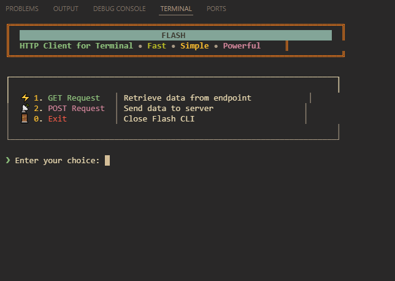
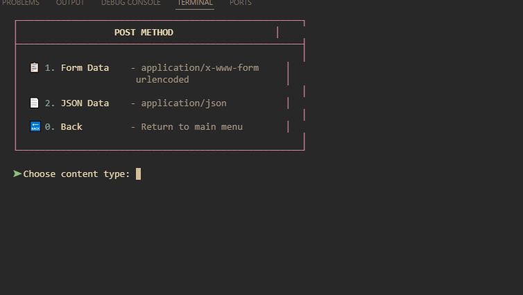
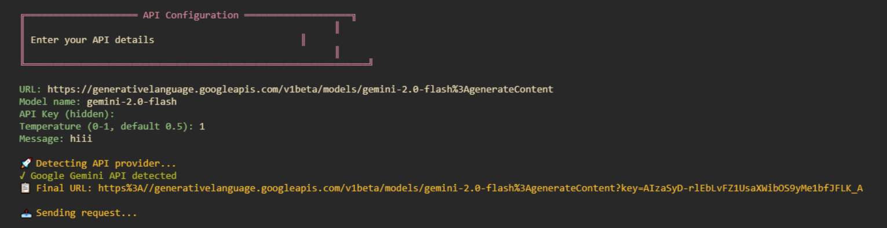

# Flash HTTP CLI

> A fast, simple, and powerful HTTP client for your terminal - like Postman, but in CLI with AI API support

Flash is a terminal-based HTTP client that brings API testing to your command line. Built with C and libcurl, it's got a clean Gruvbox-themed interface that's easy on the eyes. Now with integrated AI API support for Claude, GPT, Gemini, and more.

## What it does

Make GET requests to fetch data from REST APIs with auto-generated code snippets

Send POST requests with form data and JSON payloads, supports multi-line input

Direct API calls to Claude, GPT, Gemini, Groq, Cohere, and Mistral

Auto-generate request code in JavaScript, Node.js, Python, C#, and Java

Copy generated code directly to clipboard (works with xclip, xsel, wl-copy, pbcopy)

Gruvbox dark theme with intuitive navigation

Built in C for maximum performance

Built-in self-update mechanism from GitHub releases

Proper memory management and error handling

Works on Linux, macOS, and Termux

## Screenshots

Full disclosure: I used AI to help format these screenshot sections and the fancy output examples because honestly I don't have time to mess with that documentation UI stuff.

### Main Menu


Clean and intuitive main interface with AI API option

### POST Method Selection


Easy content-type selection for POST requests

### AI API Request


Integrated AI API support with auto-detection for major providers

## Getting started

### Download Pre-built Binary (Recommended)

Grab the latest release for Linux:

```bash
# Download the latest release
wget https://github.com/aadityansha06/Flash-Http-cli/releases/latest/download/flash-linux-x64

# Make it executable
chmod +x flash-linux-x64

# Run Flash
./flash-linux-x64
```

### Build from Source

#### What you need

GCC compiler, libcurl development libraries, and optionally Make.

#### Ubuntu/Debian
```bash
sudo apt update
sudo apt install build-essential libcurl4-openssl-dev

# Optional: Install clipboard tools for code copying
sudo apt install xclip
```

#### CentOS/RHEL/Fedora
```bash
# CentOS/RHEL
sudo yum install gcc libcurl-devel

# Fedora
sudo dnf install gcc libcurl-devel xclip
```

#### macOS
```bash
# Using Homebrew
brew install curl

# pbcopy is pre-installed on macOS
```

#### Compiling

```bash
# Clone the repository
git clone https://github.com/aadityansha06/Flash-Http-cli.git
cd Flash-Http-cli

# Build using make
make

# Or compile manually
gcc Flash-cli.c -o flash -lcurl

# Run
./flash
```

### Termux Installation 
```bash
# Install dependencies
pkg update && pkg upgrade
pkg install clang curl

# Clone the repository
git clone https://github.com/aadityansha06/Flash-Http-cli.git
cd Flash-Http-cli

# Compile
clang Flash-cli.c -o flash -lcurl

# Run
./flash
```

Note: You might see some warnings about getchar() return values or empty-body while loops during compilation. They're safe to ignore - the program runs fine.

## How to use it

### GET Requests

Pick option 1 from the main menu, enter the URL like `https://jsonplaceholder.typicode.com/posts/1`, check out the response, and then generate code snippets if you want them in JavaScript, Node.js, Python, C#, or Java.

### POST Requests - Form Data

Select option 2, choose 1 for Form Data, enter how many fields you need, then type each field as `key=value`, enter the target URL, and send it. You can generate code snippets after.

Example:
```
Number of fields: 3
Field 1: name=John Doe
Field 2: email=john@example.com
Field 3: age=25
```

### POST Requests - JSON

Select option 2, choose 2 for JSON Data, enter your JSON line by line, press Enter twice when done, then enter the URL and send.

Example:
```json
{
  "name": "Flash User",
  "email": "user@example.com",
  "active": true
}
```

### AI API Requests

This is the new feature. Select option 3, enter the API endpoint URL, the model name (like `claude-3-5-sonnet-20241022`, `gpt-4`, `gemini-pro`), your API key (it's hidden while you type), set the temperature between 0 and 1 (default is 0.5), enter your message, and check out the AI response.

Supported providers: Anthropic Claude, OpenAI GPT, Google Gemini, Groq, Cohere, Mistral, and custom APIs with Bearer token auth.

## Examples

### Testing REST APIs

```bash
# GET request to fetch user data
URL: https://jsonplaceholder.typicode.com/users/1

# POST form data to create a user
Number of fields: 3
Field 1: name=Flash User
Field 2: email=flash@example.com
Field 3: phone=1234567890
URL: https://httpbin.org/post

# POST JSON data
{
  "title": "Flash HTTP CLI",
  "body": "A powerful terminal HTTP client",
  "userId": 1
}
URL: https://jsonplaceholder.typicode.com/posts
```

### AI API Examples

#### Claude API
```bash
URL: https://api.anthropic.com/v1/messages
Model: claude-3-5-sonnet-20241022
API Key: sk-ant-api03-...
Temperature: 0.7
Message: Write a hello world program in Python
```

#### OpenAI API
```bash
URL: https://api.openai.com/v1/chat/completions
Model: gpt-4
API Key: sk-...
Temperature: 0.5
Message: Explain quantum computing in simple terms
```

#### Google Gemini API
```bash
URL: https://generativelanguage.googleapis.com/v1beta/models/gemini-pro:generateContent
Model: gemini-pro
API Key: AIza...
Temperature: 0.8
Message: Generate a creative story about a robot
```

## Theme

Flash uses the Gruvbox Dark color scheme - dark background that's easy on the eyes, warm yellows and oranges for highlights, bright green for success messages, clear red for errors, cool blue accents, and purple for AI features.

## Features worth mentioning

### Auto-Update System

Flash checks GitHub releases when you start it, compares your version with the latest one, asks if you want to update when there's a new version, downloads and installs updates automatically, and backs up your current version before updating.

Skip update checks with:
```bash
export FLASH_SKIP_UPDATE=1
```

### Code Snippet Generation

After making requests, Flash can generate production-ready code in JavaScript (Fetch API), Node.js (Axios), Python (Requests), C# (HttpClient), and Java (HttpURLConnection).

### Smart Clipboard Integration

Flash automatically finds and uses whatever clipboard tool you have - xclip, xsel, wl-copy on Linux, pbcopy on macOS. If it can't find any, it saves to `flash_snippet.txt` instead.

### JSON Security

Automatically escapes quotes, backslashes, newlines, handles special characters, and validates JSON structure to prevent injection attacks.

### URL Encoding

Form data gets URL-encoded automatically. Spaces become +, special characters use % encoding.

## Contributing

Want to help? Fork the repo, create a feature branch, commit your changes, push to the branch, and open a pull request.

### Development Setup

```bash
git clone https://github.com/aadityansha06/Flash-Http-cli.git
cd Flash-Http-cli

# Install development dependencies
sudo apt install build-essential libcurl4-openssl-dev

# Build with debug symbols
gcc -g -Wall -o flash-dev Flash-cli.c -lcurl

# Test
./flash-dev
```

## Contributors

Thanks to everyone who contributed:

Core Team: @aadityansha06 - Creator and Maintainer

Contributors:
- @dexter-xD - Enhanced JSON input with multi-line support and improved UI alignment
- @sakshamg567 - Improved form-data input handling

Want to contribute? Check out the open issues or raise a PR.

## Project Structure

```
Flash-Http-cli/
├── Flash-cli.c           # Main source code
├── lib/
│   └── header-file.h     # Color definitions and includes
├── version.h             # Version information
├── Makefile              # Build configuration
├── README.md             # This file
├── LICENSE               # MIT License
└── screenshots/          # UI screenshots
```

## Known problems

Windows support needs WSL or manual libcurl setup. Really large responses over 1GB might cause memory issues. Clipboard functionality needs extra packages on some systems.

## What's coming next

Already done: GET requests with response display, POST requests (form-data and JSON), code snippet generation in 5 languages, AI API integration, auto-update system, smart clipboard support.

Still working on: Custom headers management, request/response history, configuration file support, response syntax highlighting, request templates, environment variables support, API authentication presets, response filtering and parsing.

## Security stuff

API keys are hidden while you type them. No sensitive data gets logged or stored. Memory is properly freed after use. All user input gets validated. JSON escaping prevents injection attacks.

## License

MIT License - do whatever you want with it.

## System Requirements

### Minimum
Linux/macOS/Termux, 1 MB free disk space, libcurl 7.x or higher.

### Recommended
Linux/macOS with clipboard tools installed, 10 MB free disk space for updates, modern terminal with UTF-8 support, internet connection for API requests.

## Troubleshooting

### Compilation Errors

If you get "curl/curl.h not found":
```bash
# Ubuntu/Debian
sudo apt install libcurl4-openssl-dev

# CentOS/RHEL
sudo yum install libcurl-devel

# macOS
brew install curl
```

If you get "undefined reference to curl_easy_init":
```bash
# Make sure to link with -lcurl flag
gcc Flash-cli.c -o flash -lcurl
```

### Runtime Issues

Clipboard not working? Install a clipboard tool:
```bash
sudo apt install xclip  # or xsel, wl-clipboard
```

Update check fails? Skip it:
```bash
export FLASH_SKIP_UPDATE=1
./flash
```

API request fails? Check your API key is correct, verify your internet connection, make sure the API endpoint URL is right, and confirm the model name matches your provider.

## Support

Open an issue on GitHub, start a discussion in the repository, or report bugs with detailed reproduction steps.

## Credits

libcurl - The HTTP library powering Flash

Gruvbox - The color scheme

Inspired by Postman

Thanks to all AI providers for their APIs

## Author

Aadityansh
- GitHub: @aadityansha06
- Project Link: https://github.com/aadityansha06/Flash-Http-cli

---

Flash HTTP CLI - Fast, Simple, Powerful

Made with C and libcurl

Star this repo | Report Bug | Request Feature
